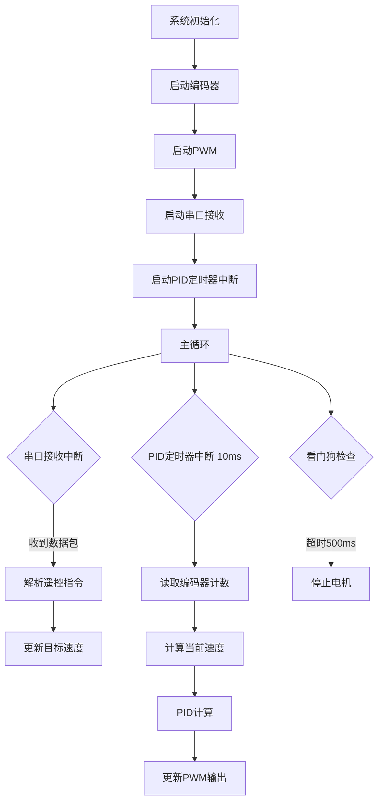

# NDT_Robot 编码器电机闭环控制开发计划

## 一、目录分析与可用资源

### 1.1 现有代码资源

**可直接使用的底层驱动：**

- `CODE/NDT_Robot_Main/` - 基于STM32 HAL库的主项目框架
  - 已配置：USART1（9600波特率）、TIM3（PWM输出）
  - 已实现：遥控协议解析（12字节数据包，0xAA/0x55帧头帧尾，XOR校验）
- `CODE/STM32F103VCT6/5_Official_Demo_Code/` - STM32F10x标准外设库示例代码
- `塔克 l MC130编码器TT马达电机资料 V20240619/` - 参考代码库
  - `4 小车底盘控制源码/` - 完整的编码器+PID控制实现（STM32F4标准库，可参考架构）
  - `2 STM32电机PID教程/` - PID控制教程和示例

**参考代码关键文件：**

- `ax_encoder.c/h` - 编码器驱动（使用定时器编码器模式，TIM_EncoderMode_TI12）
- `ax_motor.c/h` - 电机PWM控制（双路PWM实现正反转）
- `ax_speed.c/h` - PID速度控制（增量式PD控制器）

### 1.2 硬件资源分析

**STM32F103 编码器接口能力：**

- TIM1/TIM2/TIM3/TIM4/TIM5 支持编码器模式
- 编码器模式：TI1和TI2两路正交信号输入
- 自动计数，支持4倍频

**当前配置（main.c）：**

- TIM3 已用于PWM输出（CH1），需重新规划或使用其他定时器
- USART1 用于遥控通信（中断接收）

## 二、开发路径规划

### 阶段1：编码器接口实现（底层驱动）

**目标：** 实现编码器数据采集

**步骤：**

1. 选择定时器资源（建议：TIM2/TIM4用于编码器，TIM3保留PWM或改用TIM1）
2. 配置定时器为编码器模式（HAL库：`HAL_TIM_Encoder_Init`）
3. 实现编码器计数读取函数
4. 实现速度计算（差分法：`速度 = (当前计数 - 上次计数) / 时间间隔`）

**文件结构：**

```
CODE/NDT_Robot_Main/
├── Core/
│   └── Src/
│       └── encoder.c        # 新建：编码器驱动
│   └── Inc/
│       └── encoder.h
```

**关键配置（参考ax_encoder.c）：**

- 编码器模式：`TIM_ENCODERMODE_TI12`（4倍频）
- 滤波器：`TIM_ICFILTER` = 6（抗干扰）
- 计数器范围：0-65535（16位）

### 阶段2：PID控制算法实现

**目标：** 实现闭环速度控制

**步骤：**

1. 创建PID控制器结构体（Kp, Ki, Kd参数）
2. 实现增量式PID算法（参考ax_speed.c的PD控制器，扩展为完整PID）
3. 实现速度计算模块（编码器计数转速度：脉冲/秒 或 RPM）
4. 集成PID输出到PWM控制

**文件结构：**

```
CODE/NDT_Robot_Main/
├── Core/
│   └── Src/
│       └── pid_controller.c # 新建：PID算法
│   └── Inc/
│       └── pid_controller.h
```

**PID算法位置建议：**

- 放在 `Core/Src/pid_controller.c`，作为独立模块
- 每个电机一个PID实例（结构体封装）

**速度计算方式：**

- 定时采样：使用定时器中断（如1ms或10ms）读取编码器计数
- 速度 = `(encoder_count_now - encoder_count_last) / sample_time`
- 单位转换：根据编码器线数转换为RPM或m/s

### 阶段3：遥控通信与电机控制集成

**目标：** 将遥控指令转换为PID目标速度

**步骤：**

1. 扩展协议解析：将遥控速度值（0-255）映射到目标速度（RPM或脉冲/秒）
2. 在主循环中调用PID计算和PWM更新
3. 实现看门狗机制（500ms超时保护，已有基础实现）

**集成点（main.c）：**

- `HAL_UART_RxCpltCallback` - 解析遥控指令，更新目标速度
- `main()` 主循环 - 调用PID计算，更新PWM输出

### 阶段4：实时性优化

**目标：** 解决遥控通信与电机高频控制的实时性矛盾

**关键配置：**

1. **中断优先级配置（NVIC）：**
   ```
   编码器定时器中断：优先级 0（最高）
   PID计算定时器中断：优先级 1
   串口接收中断：优先级 2（较低，避免阻塞编码器）
   ```

2. **串口接收优化：**

   - 当前使用 `HAL_UART_Receive_IT`（单字节中断），已较优
   - 可考虑DMA接收（`HAL_UART_Receive_DMA`）进一步降低CPU占用
   - DMA配置：循环模式，12字节缓冲区

3. **PID计算频率：**

   - 建议：10ms（100Hz）或20ms（50Hz）
   - 使用定时器中断触发（如TIM6/TIM7基本定时器）
   - 避免在主循环中轮询，确保实时性

4. **编码器读取：**

   - 编码器计数寄存器直接读取（无需中断）
   - 在PID定时器中断中读取，保证同步

## 三、核心实现方案

### 3.1 编码器驱动架构

```c
// encoder.h 接口设计
typedef struct {
    TIM_HandleTypeDef *htim;
    int32_t count_last;      // 上次计数
    int32_t count_total;     // 累计计数（处理溢出）
    float speed_rps;         // 当前速度（转/秒）
} Encoder_TypeDef;

void Encoder_Init(Encoder_TypeDef *enc, TIM_HandleTypeDef *htim);
int32_t Encoder_GetCount(Encoder_TypeDef *enc);
float Encoder_GetSpeed(Encoder_TypeDef *enc, float dt);  // dt: 采样时间间隔
```

**实现要点：**

- 使用 `HAL_TIM_Encoder_Start()` 启动编码器
- 读取计数：`__HAL_TIM_GET_COUNTER(htim)`
- 处理16位溢出：使用有符号32位累加

### 3.2 PID控制器架构

```c
// pid_controller.h 接口设计
typedef struct {
    float kp, ki, kd;        // PID参数
    float target;            // 目标值
    float current;           // 当前值
    float integral;          // 积分累积
    float last_error;        // 上次误差
    float output;            // 输出值
    float output_max;        // 输出限幅
    float output_min;
} PID_Controller_TypeDef;

void PID_Init(PID_Controller_TypeDef *pid, float kp, float ki, float kd);
float PID_Compute(PID_Controller_TypeDef *pid, float target, float current);
```

**算法实现（位置增量式PID）：**

```c
error = target - current;
integral += error * dt;
output = kp * error + ki * integral + kd * (error - last_error) / dt;
// 限幅和积分抗饱和处理
```

### 3.3 主控制流程



## 四、避坑指南

### 4.1 硬件中断配置

**中断优先级设置（stm32f1xx_it.c）：**

```c
// 在main.c的初始化部分添加
HAL_NVIC_SetPriority(TIM2_IRQn, 0, 0);  // 编码器定时器：最高优先级
HAL_NVIC_SetPriority(TIM6_IRQn, 1, 0);  // PID计算定时器：次高优先级
HAL_NVIC_SetPriority(USART1_IRQn, 2, 0); // 串口：较低优先级
```

**注意事项：**

- 编码器模式本身不需要中断（硬件自动计数）
- PID计算定时器中断要短（只做计算，不阻塞）
- 串口中断回调中避免长时间处理（当前实现已优化）

### 4.2 DMA配置建议

**串口DMA接收（可选优化）：**

- 使用 `HAL_UART_Receive_DMA(&huart1, rx_buffer, 12)`
- 配置DMA为循环模式，自动接收
- 在 `HAL_UART_RxCpltCallback` 中检查完整数据包
- 优势：降低CPU中断频率，提高实时性

### 4.3 编码器数据采集方式

**推荐方案：定时器中断采样**

- 使用基本定时器（TIM6/TIM7）产生固定周期中断（10ms）
- 在中断中读取编码器计数，计算速度
- 避免在主循环中轮询，保证采样频率稳定

**速度计算防抖：**

- 使用移动平均滤波（3-5个采样点）
- 或使用一阶低通滤波：`speed_filtered = 0.8 * speed_filtered + 0.2 * speed_raw`

### 4.4 PID参数调试

**初始参数建议：**

- Kp: 1.0-5.0（根据电机特性调整）
- Ki: 0.01-0.1（积分项，消除稳态误差）
- Kd: 0.1-1.0（微分项，抑制超调）

**调试方法：**

- 先调Kp（比例项），观察响应速度
- 再调Kd（微分项），抑制震荡
- 最后调Ki（积分项），消除稳态误差
- 使用串口输出调试信息（速度、PID输出值）

### 4.5 实时性矛盾处理

**问题：** 遥控通信（10Hz）与PID控制（100Hz）频率不匹配

**解决方案：**

1. **异步更新目标值：** 遥控指令更新目标速度变量（volatile），PID定时器中断中读取
2. **中断嵌套：** 确保PID中断可抢占串口中断
3. **数据保护：** 使用临界区保护共享变量（`__disable_irq()` / `__enable_irq()`）

## 五、文件组织建议

```
CODE/NDT_Robot_Main/
├── Core/
│   ├── Inc/
│   │   ├── encoder.h              # 编码器驱动头文件
│   │   ├── pid_controller.h      # PID控制器头文件
│   │   └── motor_control.h        # 电机控制统一接口
│   └── Src/
│       ├── encoder.c              # 编码器驱动实现
│       ├── pid_controller.c      # PID算法实现
│       ├── motor_control.c        # 电机控制逻辑（整合编码器+PID+PWM）
│       └── main.c                 # 主程序（协议解析+控制流程）
```

## 六、开发顺序建议

1. **第一步：** 实现编码器接口，验证计数读取
2. **第二步：** 实现速度计算，验证速度反馈
3. **第三步：** 实现PID控制器，开环测试
4. **第四步：** 集成PID闭环控制，调试参数
5. **第五步：** 优化实时性，配置中断优先级
6. **第六步：** 系统联调，验证遥控+闭环控制

## 七、参考资源位置

- **编码器驱动参考：** `塔克 l MC130编码器TT马达电机资料 V20240619/4 小车底盘控制源码/编码器电机小车控制源码V1.0.230626/Driver/ax_encoder.c`
- **PID控制参考：** `塔克 l MC130编码器TT马达电机资料 V20240619/4 小车底盘控制源码/编码器电机小车控制源码V1.0.230626/Robot/ax_speed.c`
- **电机PWM参考：** `塔克 l MC130编码器TT马达电机资料 V20240619/4 小车底盘控制源码/编码器电机小车控制源码V1.0.230626/Driver/ax_motor.c`
- **HAL库文档：** STM32CubeMX生成的代码已包含HAL库配置